# 🔄 Flowchart & Diagram Alir
# Sifiso — Dynamic Portfolio Website

**Version:** 1.0  
**Date:** 14 April 2026

---

## 1. System Architecture Overview

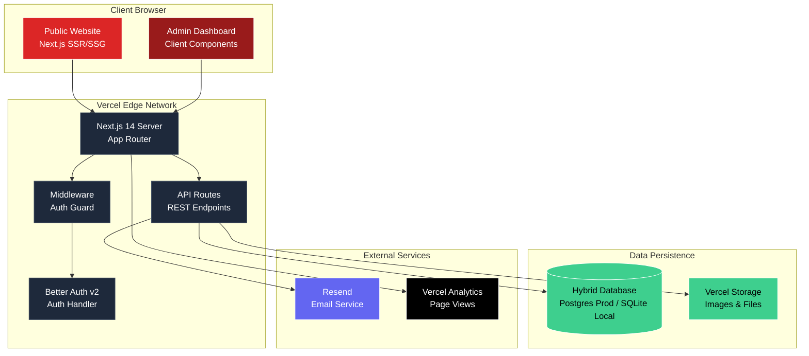

---

## 2. User Flow — Public Visitor

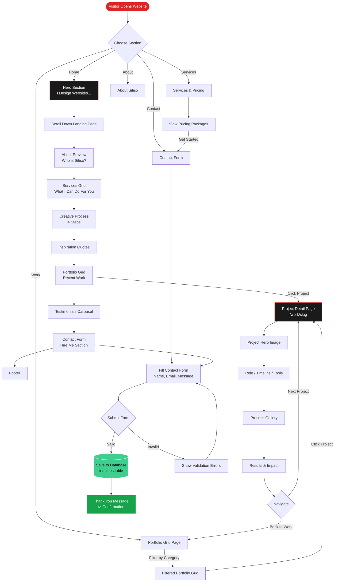

---

## 3. User Flow — Admin (CMS)

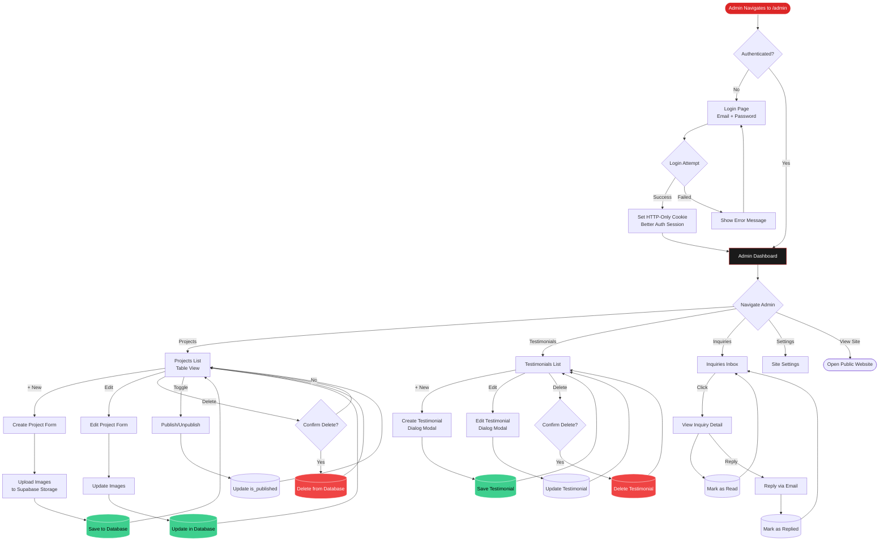

---

## 4. Authentication Flow (Better Auth v2)

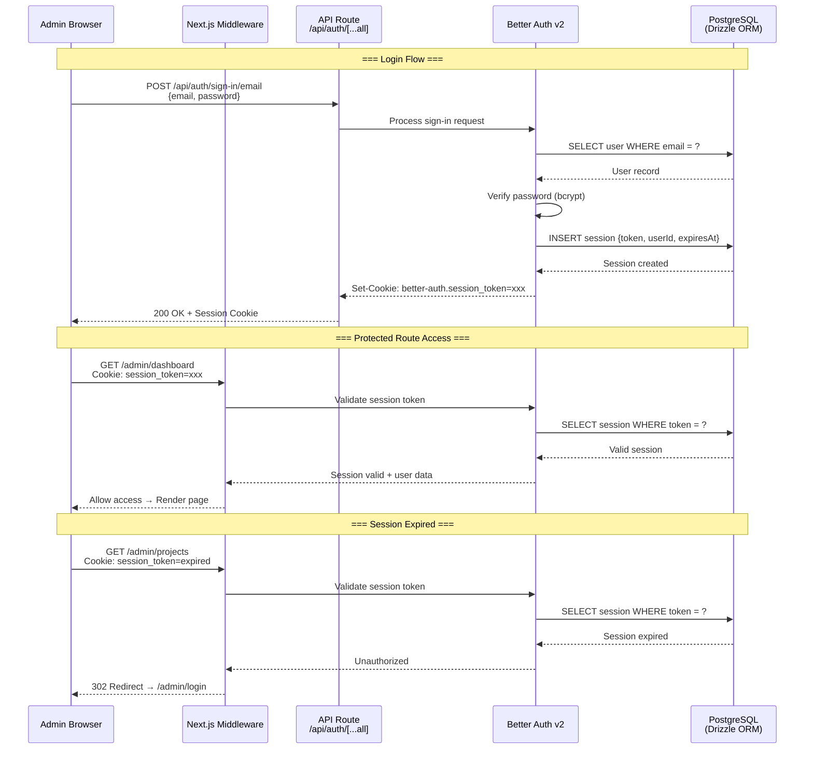

---

## 5. Data Flow — Project CRUD

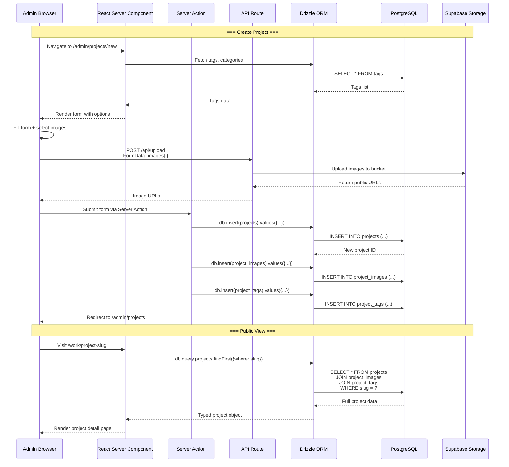

---

## 6. Contact Form Submission Flow

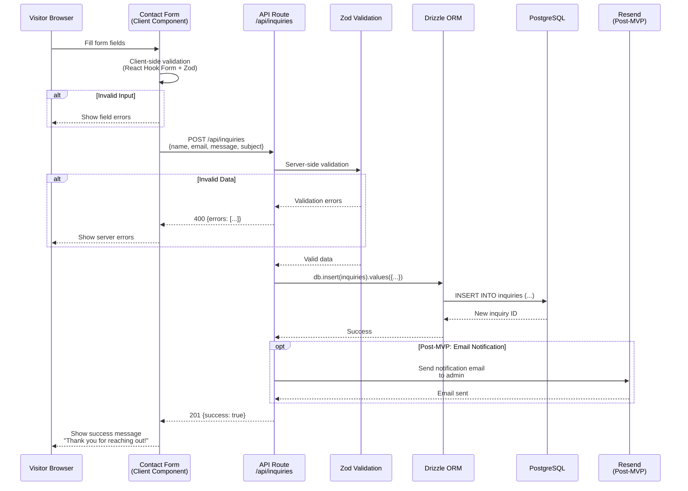

---

## 7. Image Upload Pipeline

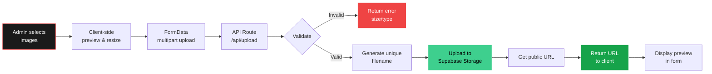

---

## 8. Monorepo Build Pipeline

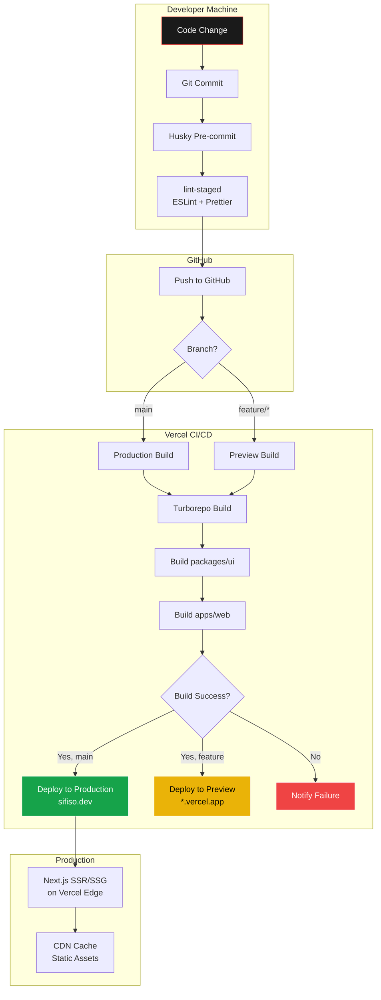

---

## 9. Page Rendering Strategy

```mermaid
flowchart TD
    subgraph "Static Generation (SSG)"
        A[Landing Page<br/>Home] -->|ISR revalidate: 3600| A1[Cached 1hr]
        B[About Page] -->|ISR revalidate: 86400| B1[Cached 24hr]
        C[Services Page] -->|ISR revalidate: 86400| C1[Cached 24hr]
    end

    subgraph "Server-Side Rendering (SSR)"
        D[Project Detail<br/>/work/slug] -->|generateStaticParams| D1[Pre-rendered at build]
        D1 -->|ISR revalidate: 3600| D2[Re-rendered on demand]
    end

    subgraph "Client-Side Rendering (CSR)"
        E[Admin Dashboard] -->|useSession + SWR| E1[Real-time data]
        F[Admin Forms] -->|React Hook Form| F1[Interactive UI]
    end

    subgraph "Server Components (RSC)"
        G[Portfolio Grid] -->|Direct DB query| G1[Zero JS sent to client]
        H[Testimonials] -->|Direct DB query| H1[Zero JS sent to client]
    end

    style A fill:#3ECF8E,stroke:#fff,color:#000
    style B fill:#3ECF8E,stroke:#fff,color:#000
    style C fill:#3ECF8E,stroke:#fff,color:#000
    style D fill:#6366F1,stroke:#fff,color:#fff
    style E fill:#DC2626,stroke:#fff,color:#fff
    style F fill:#DC2626,stroke:#fff,color:#fff
    style G fill:#0EA5E9,stroke:#fff,color:#fff
    style H fill:#0EA5E9,stroke:#fff,color:#fff
```

---

## 10. Database Migration Flow

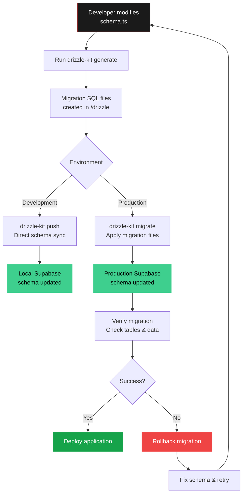

---

## 11. Complete Page Map (Sitemap)

```mermaid
graph TD
    Root[sifiso.dev] --> Public
    Root --> Admin
    Root --> API
    
    subgraph "Public Pages"
        Public["/"] --> Home["/ (Home Landing)"]
        Public --> About["/about"]
        Public --> Work["/work"]
        Work --> WorkDetail["/work/[slug]"]
        Public --> ServicesPg["/services"]
        Public --> Contact["/contact"]
        Public --> NotFound["/404"]
    end
    
    subgraph "Admin Pages (Auth Required)"
        Admin["/admin"] --> Login["/admin/login"]
        Admin --> Dash["/admin/dashboard"]
        Admin --> AdminProj["/admin/projects"]
        AdminProj --> NewProj["/admin/projects/new"]
        AdminProj --> EditProj["/admin/projects/[id]/edit"]
        Admin --> AdminTest["/admin/testimonials"]
        Admin --> AdminInq["/admin/inquiries"]
        Admin --> AdminSet["/admin/settings"]
    end
    
    subgraph "API Routes"
        API["/api"] --> AuthAPI["/api/auth/[...all]"]
        API --> ProjAPI["/api/projects"]
        ProjAPI --> ProjSlugAPI["/api/projects/[slug]"]
        API --> ServAPI["/api/services"]
        API --> TestAPI["/api/testimonials"]
        API --> InqAPI["/api/inquiries"]
        API --> UploadAPI["/api/upload"]
        API --> AdminAPI["/api/admin/*"]
    end

    style Root fill:#DC2626,stroke:#fff,color:#fff
    style Home fill:#1A1A1A,stroke:#DC2626,color:#fff
    style Dash fill:#991B1B,stroke:#fff,color:#fff
    style AuthAPI fill:#6366F1,stroke:#fff,color:#fff
```

---

## 12. State Management Architecture

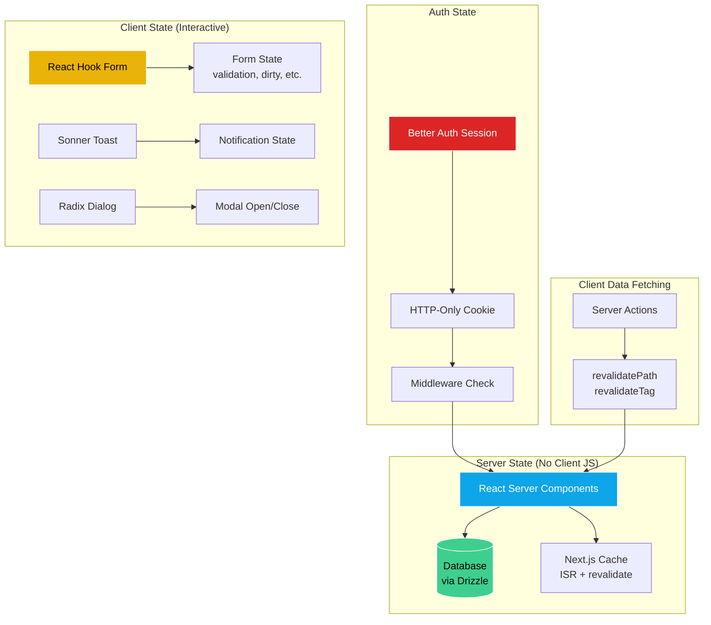

---

## Ringkasan Diagram

| # | Diagram | Tipe | Tujuan |
|---|---------|------|--------|
| 1 | System Architecture | Graph | Overview seluruh stack & koneksi |
| 2 | Public Visitor Flow | Flowchart | Navigasi pengunjung website |
| 3 | Admin CMS Flow | Flowchart | Alur kerja admin mengelola konten |
| 4 | Authentication Flow | Sequence | Detail teknis Better Auth v2 |
| 5 | Project CRUD Flow | Sequence | Alur data create/read project |
| 6 | Contact Form Flow | Sequence | Alur submit contact form |
| 7 | Image Upload Pipeline | Flowchart | Proses upload gambar |
| 8 | Build Pipeline | Flowchart | CI/CD dari commit sampai deploy |
| 9 | Page Rendering Strategy | Flowchart | SSG vs SSR vs CSR decisions |
| 10 | Database Migration | Flowchart | Alur migrasi database |
| 11 | Sitemap | Graph | Peta halaman lengkap |
| 12 | State Management | Flowchart | Arsitektur state management |
