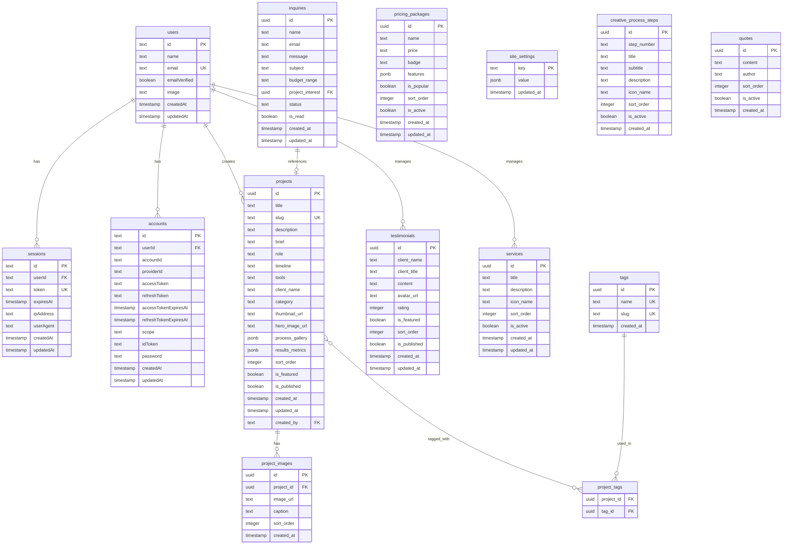

# 📋 Product Requirements Document (PRD)
# Sifiso — Dynamic Portfolio Website

**Version:** 2.0 (v2.0 Completion)  
**Date:** 05 June 2026  
**Author:** Antigravity AI  
**Status:** v2.0 (Month 2) Completed

---

## 1. Executive Summary

**Sifiso** adalah website portfolio dinamis untuk seorang desainer/developer profesional. Versi final ini menggunakan arsitektur modern berbasis **Next.js 16 (App Router)** dalam monorepo Turborepo. Sistem menggunakan model **Hybrid Database**: SQLite (better-sqlite3) untuk pengembangan lokal yang cepat dan Vercel PostgreSQL untuk stabilitas produksi.

### Tujuan Utama
- Membangun website portfolio yang **dinamis** — semua konten (projects, testimonials, inquiries, SEO) dikelola via Dashboard.
- Memberikan kesan **premium** dengan "Bright Mode" Admin yang bersih dan Landing Page yang futuristik.
- Menyediakan **Offline-First Development** menggunakan database lokal tanpa ketergantungan internet.
- Mengoptimalkan **SEO** melalui dashboard meta-editor yang terintegrasi (Dynamic SEO).
- **[v2.0]** Mendukung lokalisasi i18n (Multi-bahasa) untuk jangkauan global.
- **[v2.0]** Menawarkan sistem Portal Klien, pelacakan proyek, dan manajemen *invoicing* terintegrasi.

---

## 2. Target Users

| Persona | Deskripsi | Kebutuhan |
|---------|-----------|-----------|
| **Sifiso (Owner/Admin)** | Desainer & developer profesional | Mengelola portfolio, projects, testimonials, pricing, dan menerima inquiry |
| **Potential Clients** | Bisnis/individu yang mencari jasa desain | Melihat portfolio, membaca testimonials, memahami layanan & pricing, mengirim inquiry |
| **Recruiters/Collaborators** | HR atau sesama profesional | Melihat skill, pengalaman, dan kualitas karya Sifiso |

---

## 3. Tech Stack

### 3.1 Frontend
| Teknologi | Versi | Fungsi |
|-----------|-------|--------|
| Next.js | 16 (App Router) | Framework utama + SSR/SSG |
| React | 19 | UI Library |
| Tailwind CSS | v4 | Styling utility-first |
| Framer Motion | Latest | Animasi & transisi |
| Lucide React | Latest | Icon system |

### 3.2 Backend
| Teknologi | Versi | Fungsi |
|-----------|-------|--------|
| Next.js Server Actions | 16 | Core logic & form handling |
| Drizzle ORM | Latest | Type-safe database queries |
| Better Auth | v2 | Authentication admin |
| Local Storage | N/A | File/image uploads (Local MVP) |
| Resend | Latest | Email service untuk contact form |

### 3.3 Monorepo & Tooling
| Teknologi | Fungsi |
|-----------|--------|
| Turborepo | Monorepo orchestration & caching |
| npm | Package manager |
| TypeScript | Type safety |
| ESLint | Linting |
| Prettier | Code formatting |
| Husky + lint-staged | Git hooks |

### 3.4 Infrastructure
| Layanan | Fungsi |
|---------|--------|
| Vercel | Hosting & deployment |
| Neon | Database (PostgreSQL) |
| GitHub | Version control |

---

## 4. Monorepo Structure

```
sifiso/
├── apps/
│   └── web/                          # Next.js 14 Application
│       ├── src/
│       │   ├── app/                  # App Router
│       │   │   ├── (public)/         # Route Group: Public pages
│       │   │   │   ├── page.tsx          # Home / Landing
│       │   │   │   ├── about/page.tsx    # About Sifiso
│       │   │   │   ├── work/             # Portfolio gallery
│       │   │   │   │   ├── page.tsx
│       │   │   │   │   └── [slug]/page.tsx  # Project detail
│       │   │   │   ├── services/page.tsx    # Services & pricing
│       │   │   │   └── contact/page.tsx     # Contact form
│       │   │   ├── (admin)/          # Route Group: Admin panel
│       │   │   │   ├── layout.tsx        # Admin layout + auth guard
│       │   │   │   ├── dashboard/page.tsx    # Admin overview
│       │   │   │   ├── projects/            # CRUD projects
│       │   │   │   │   ├── page.tsx
│       │   │   │   │   ├── new/page.tsx
│       │   │   │   │   └── [id]/edit/page.tsx
│       │   │   │   ├── testimonials/page.tsx
│       │   │   │   ├── services/page.tsx
│       │   │   │   ├── inquiries/page.tsx
│       │   │   │   └── settings/page.tsx
│       │   │   ├── api/              # API Routes
│       │   │   │   ├── auth/[...all]/route.ts  # Better Auth
│       │   │   │   ├── projects/route.ts
│       │   │   │   ├── testimonials/route.ts
│       │   │   │   ├── services/route.ts
│       │   │   │   ├── inquiries/route.ts
│       │   │   │   └── upload/route.ts
│       │   │   ├── layout.tsx        # Root layout
│       │   │   └── not-found.tsx     # 404 page
│       │   ├── components/           # App-specific components
│       │   │   ├── sections/         # Landing page sections
│       │   │   │   ├── hero.tsx
│       │   │   │   ├── about-preview.tsx
│       │   │   │   ├── services-grid.tsx
│       │   │   │   ├── portfolio-grid.tsx
│       │   │   │   ├── testimonials-carousel.tsx
│       │   │   │   ├── creative-process.tsx
│       │   │   │   ├── contact-form.tsx
│       │   │   │   └── quotes-section.tsx
│       │   │   ├── portal/           # [v2.0] Client Portal
│       │   │   │   └── invoices/     # Printable invoices
│       │   │   ├── admin/            # Admin components
│       │   │   └── shared/           # Shared app components
│       │   │       ├── navbar.tsx
│       │   │       ├── footer.tsx
│       │   │       └── page-transition.tsx
│       │   ├── lib/                  # Utilities & configs
│       │   │   ├── auth.ts           # Better Auth server config
│       │   │   ├── auth-client.ts    # Better Auth client
│       │   │   ├── db/
│       │   │   │   ├── index.ts      # Drizzle client
│       │   │   │   ├── schema.ts     # Database schema
│       │   │   │   └── migrations/   # SQL migrations
│       │   │   ├── supabase.ts       # Supabase client (storage)
│       │   │   └── utils.ts
│       │   └── hooks/                # Custom React hooks
│       ├── public/                   # Static assets
│       ├── drizzle.config.ts
│       ├── next.config.js
│       ├── tailwind.config.ts
│       ├── components.json           # shadcn/ui config
│       └── package.json
├── packages/
│   ├── ui/                           # Shared UI components (shadcn/ui)
│   │   ├── src/
│   │   │   ├── components/           # Reusable shadcn components
│   │   │   │   ├── button.tsx
│   │   │   │   ├── card.tsx
│   │   │   │   ├── dialog.tsx
│   │   │   │   ├── input.tsx
│   │   │   │   ├── textarea.tsx
│   │   │   │   ├── badge.tsx
│   │   │   │   ├── table.tsx
│   │   │   │   ├── dropdown-menu.tsx
│   │   │   │   ├── toast.tsx
│   │   │   │   └── ...
│   │   │   ├── lib/
│   │   │   │   └── utils.ts          # cn() helper
│   │   │   └── styles/
│   │   │       └── globals.css       # Tailwind base styles
│   │   ├── components.json
│   │   └── package.json
│   ├── typescript-config/            # Shared TS configs
│   │   ├── base.json
│   │   ├── nextjs.json
│   │   └── package.json
│   └── eslint-config/                # Shared ESLint configs
│       ├── next.js
│       └── package.json
├── turbo.json                        # Turborepo config
├── npm-workspaces (package.json)
├── package.json
└── .env.local
```

---

## 5. Database Schema (Drizzle ORM)

### 5.1 Entity Relationship Diagram



---

## 6. Feature Specifications

### 6.1 Public Website (Frontend)

#### 6.1.1 Navigation Bar
- **Logo:** "Sifiso..." branding text dengan font custom
- **Menu Items:** Work, Services, About, Contact
- **CTA Button:** "Get in Touch" — merah (#DC2626)
- **Behavior:** Sticky on scroll, backdrop blur, smooth scroll navigation
- **Mobile:** Hamburger menu dengan slide-in panel

#### 6.1.2 Hero Section
- **Heading:** Animasi typewriter "I DESIGN WEBSITES..."
- **3D Element:** Mug/object dengan efek parallax
- **Background:** Dark gradient dengan subtle pattern overlay
- **CTA Buttons:** "See my work" (outline) + "Contact me" (filled red)

#### 6.1.3 About Section (Who Is Sifiso?)
- **Photo:** Professional portrait dengan gradient overlay
- **Bio:** Dynamically loaded dari database
- **Skills Badges:** UI/UX Design, 3D Modeling, Brand Identity, Webflow
- **Stats Counter:** Years experience, projects completed, happy clients

#### 6.1.4 Services Grid
- **Cards:** 4 service cards (UI/UX, Web Dev, 3D Viz, Branding)
- **Icons:** Animated SVG icons per service
- **Hover Effect:** Scale + glow border merah
- **Data Source:** `services` table via API

#### 6.1.5 Creative Process
- **Timeline Layout:** 4 steps — Discovery → Concept → Design → Delivery
- **Icons:** Animated decorative icons
- **Connecting Line:** Pulse animation antara steps
- **Data Source:** `creative_process_steps` table

#### 6.1.6 Quotes Section
- **Layout:** Inspirational quotes dengan tipografi besar
- **Authors:** Attribution (Pablo Picasso, Renoir, dll.)
- **Data Source:** `quotes` table

#### 6.1.7 Portfolio Grid ("Recent Work")
- **Layout:** Masonry/grid gallery responsive
- **Hover Overlay:** Project name + "View Project" button
- **Filtering:** Tabs by category (All, UI/UX, Branding, Web, 3D)
- **Pagination:** Infinite scroll atau "Load More"
- **Data Source:** `projects` table + `project_images`

#### 6.1.8 Project Detail Page (`/work/[slug]`)
- **Hero:** Full-width project image dengan title overlay
- **Overview:** Role, Timeline, Tools, About
- **Process Gallery:** Scrollable image gallery
- **Results/Impact:** Stats (e.g., 20% engagement, 4.9 rating)
- **Navigation:** Next/Previous project
- **Data Source:** Individual project from `projects` table

#### 6.1.9 Testimonials Carousel
- **Auto-rotate:** Carousel dengan 3 visible cards
- **Content:** Client quote, name, title
- **Styling:** Border merah, dark card background
- **Data Source:** `testimonials` table

#### 6.1.10 Pricing Packages
- **3 Tiers:** Starter ($1,500+), Professional ($3,500+), Enterprise ($6,500+)
- **Popular Badge:** "Most Popular" on Professional tier
- **CTA:** "Get Started" button per tier
- **Data Source:** `pricing_packages` table

#### 6.1.11 Contact Form ("Hire Me")
- **Fields:** Name, Email, Subject, Budget Range (dropdown), Message, Project Interest
- **Validation:** Client-side + server-side validation
- **Submission:** Save to `inquiries` table + send email notification via Resend
- **Success State:** "Thank you for reaching out!" dengan checkmark animation

#### 6.1.12 Footer
- **Social Links:** GitHub, LinkedIn, Dribbble, Twitter/X
- **Quick Links:** Navigation mirror
- **Copyright:** Dynamic year

#### 6.1.13 404 Page
- **Design:** Neon glitch effect "404"
- **Message:** "Oopsy! It looks like you've wandered off the grid."
- **CTA:** "BACK TO REALITY" button

---

### 6.2 Admin Dashboard (CMS)

#### 6.2.1 Authentication
- **Login:** Email + Password via Better Auth v2
- **Session:** HTTP-only cookies, automatic refresh
- **Protected Routes:** Middleware guard di `/admin/*`
- **Role:** Single admin (owner only)

#### 6.2.2 Dashboard Overview
- **Stats Cards:** Total Projects, Total Inquiries (unread), Total Testimonials, Page Views
- **Recent Inquiries:** Quick list
- **Quick Actions:** Add Project, View Site

#### 6.2.3 Projects Management
- **List View:** Table dengan thumbnail, title, category, status, date
- **Create/Edit:** Rich form — title, slug (auto-generate), description, brief, images upload (drag & drop), category, tags, process gallery, results metrics
- **Image Upload:** Multi-image upload ke local file system (`public/uploads`)
- **Publish/Unpublish:** Toggle switch
- **Reorder:** Drag-and-drop sort order
- **Delete:** Soft delete dengan confirmation modal

#### 6.2.4 Testimonials Management
- **CRUD:** Add, edit, delete testimonials
- **Fields:** Client name, title, quote, avatar, rating, featured toggle

#### 6.2.5 Services Management
- **CRUD:** Add, edit, delete services
- **Fields:** Title, description, icon selection, sort order

#### 6.2.6 Pricing Management
- **CRUD:** Add, edit, delete pricing packages
- **Fields:** Name, price, features (dynamic list), popular badge, sort order

#### 6.2.7 Inquiries
- **Inbox View:** List dengan status (unread/read/replied/archived)
- **Detail View:** Full message + reply via email
- **Filters:** By status, date range

#### 6.2.8 Site Settings
- **General:** Site title, description, meta tags
- **About:** Bio text, photo, skills
- **Social:** Social media links
- **Quotes:** Manage inspiration quotes
- **Creative Process:** Manage process steps

#### 6.2.9 [v2.0] Blog Management
- **CRUD:** Artikel dengan format Markdown/HTML, status *draft/published*.
- **Kategori:** Manajemen kategori artikel blog.

#### 6.2.10 [v2.0] Client Portal & Invoicing
- **Klien:** Manajemen akses klien untuk melihat progress proyek.
- **Milestone:** Penanda status penyelesaian tahap proyek (Pending, In Progress, Completed).
- **Invoice:** Pembuatan tagihan proyek dengan antarmuka cetak mandiri untuk klien.

---

## 7. API Endpoints

### 7.1 Public API

| Method | Endpoint | Description |
|--------|----------|-------------|
| `GET` | `/api/projects` | List published projects (with pagination & filter) |
| `GET` | `/api/projects/[slug]` | Get single project by slug |
| `GET` | `/api/services` | List active services |
| `GET` | `/api/pricing` | List active pricing packages |
| `GET` | `/api/testimonials` | List published testimonials |
| `GET` | `/api/quotes` | List active quotes |
| `GET` | `/api/process` | List creative process steps |
| `GET` | `/api/settings/[key]` | Get site setting by key |
| `POST` | `/api/inquiries` | Submit contact form |

### 7.2 Admin API (Auth Required)

| Method | Endpoint | Description |
|--------|----------|-------------|
| `POST` | `/api/auth/[...all]` | Better Auth handler |
| `GET/POST` | `/api/admin/projects` | CRUD projects |
| `PUT/DELETE` | `/api/admin/projects/[id]` | Update/delete project |
| `GET/POST` | `/api/admin/testimonials` | CRUD testimonials |
| `PUT/DELETE` | `/api/admin/testimonials/[id]` | Update/delete testimonial |
| `GET/POST` | `/api/admin/services` | CRUD services |
| `GET/POST` | `/api/admin/pricing` | CRUD pricing |
| `GET` | `/api/admin/inquiries` | List all inquiries |
| `PUT` | `/api/admin/inquiries/[id]` | Update inquiry status |
| `POST` | `/api/upload` | Upload images to local storage |
| `PUT` | `/api/admin/settings` | Update site settings |

---

## 8. Design System

### 8.1 Color Palette

| Token | Value | Usage |
|-------|-------|-------|
| `--background` | `#0A0A0A` | Page background |
| `--surface` | `#141414` | Card backgrounds |
| `--surface-elevated` | `#1A1A1A` | Elevated elements |
| `--border` | `#2A2A2A` | Borders & dividers |
| `--border-accent` | `#DC2626` | Accent borders |
| `--primary` | `#DC2626` | Primary CTA & accents |
| `--primary-hover` | `#B91C1C` | Button hover state |
| `--primary-foreground` | `#FFFFFF` | Text on primary |
| `--text-primary` | `#FFFFFF` | Headings |
| `--text-secondary` | `#A1A1AA` | Body text |
| `--text-muted` | `#71717A` | Subtle text |

### 8.2 Typography

| Element | Font | Weight | Size |
|---------|------|--------|------|
| Display (Hero) | Inter / Custom Bold | 900 | 48-72px |
| H1 | Inter | 700 | 36-48px |
| H2 | Inter | 700 | 28-36px |
| H3 | Inter | 600 | 20-24px |
| Body | Inter | 400 | 16px |
| Small | Inter | 400 | 14px |
| Quote | Serif (Playfair Display) | 700 | 24-32px |

### 8.3 Spacing System
Base unit: 4px. Scale: 4, 8, 12, 16, 20, 24, 32, 40, 48, 64, 80, 96, 128px

### 8.4 Border Radius
- Buttons: 8px
- Cards: 12px
- Badges: 9999px (pill)
- Inputs: 8px

### 8.5 Shadows & Effects
- Card Shadow: `0 4px 24px rgba(0,0,0,0.4)`
- Glow (primary): `0 0 20px rgba(220,38,38,0.3)`
- Glassmorphism: `backdrop-filter: blur(12px); background: rgba(20,20,20,0.8)`

---

## 9. Non-Functional Requirements

### 9.1 Performance
- Lighthouse Score: ≥ 90 (Performance, Accessibility, SEO)
- First Contentful Paint: < 1.5s
- Largest Contentful Paint: < 2.5s
- Images: Next.js Image optimization, WebP format, lazy loading
- Static pages regenerated via ISR (Incremental Static Regeneration)

### 9.2 SEO
- Server-side rendered meta tags per page
- Dynamic OG images per project
- Structured data (JSON-LD) untuk Person + Portfolio
- Sitemap.xml & robots.txt auto-generated
- Canonical URLs

### 9.3 Accessibility
- WCAG 2.1 AA compliance
- Keyboard navigation support
- Screen reader friendly
- Color contrast ratio ≥ 4.5:1
- Focus indicators visible

### 9.4 Security
- Better Auth v2 dengan HTTP-only cookies
- CSRF protection
- Rate limiting pada contact form
- Input sanitization
- Supabase RLS policies
- Environment variables untuk secrets

### 9.5 Responsive Design
- Mobile-first approach
- Breakpoints: 640px (sm), 768px (md), 1024px (lg), 1280px (xl), 1536px (2xl)
- Touch-friendly interaction pada mobile

---

## 10. Deployment Strategy

### 10.1 Environment Setup
| Environment | Platform | Domain |
|-------------|----------|--------|
| Development | `localhost:3000` | - |
| Preview | Vercel Preview | `*.vercel.app` |
| Production | Vercel | `sifiso.dev` (TBD) |

### 10.2 CI/CD Pipeline
1. Push ke `main` → Vercel auto-deploy ke production
2. Push ke branch → Vercel preview deployment
3. Pre-commit: Lint + Type check via Husky
4. Turborepo: Cached builds untuk CI speed

### 10.3 Database
- Supabase Project: Existing `adimarya's Project` (ap-southeast-2) atau new dedicated project
- Migrations: Drizzle Kit (`npx drizzle-kit push`)

---

## 11. Risk Assessment

| Risk | Impact | Likelihood | Mitigation |
|------|--------|------------|------------|
| Supabase free tier limits | Medium | Medium | Monitor usage, upgrade jika perlu |
| Image storage costs | Low | Low | Optimize images before upload |
| Better Auth breaking changes | Medium | Low | Pin version, test upgrades |
| Monorepo complexity | Medium | Medium | Proper documentation, simple structure |

---

## 12. Timeline Estimate

| Phase | Duration | Deliverables |
|-------|----------|-------------|
| Phase 1: Foundation | 3 hari | Monorepo setup, DB schema, auth |
| Phase 2: Public Pages | 5 hari | All public pages + animations |
| Phase 3: Admin Dashboard | 4 hari | Full CMS implementation |
| Phase 4: Integration & Polish | 3 hari | API integration, testing, SEO |
| Phase 5: Deployment | 1 hari | Production deploy |
| **Total** | **~16 hari** | |

---

## 13. Success Metrics

| Metric | Target |
|--------|--------|
| Page Load Speed | < 2s |
| Lighthouse Score | ≥ 90 |
| Uptime | 99.9% |
| Contact Form Submission Rate | Track via analytics |
| Admin Content Update Time | < 2 min per update |
| Mobile Responsiveness | 100% functional |


---

## 14. MVP & Development Roadmap

# 🚀 MVP (Minimum Viable Product) Specification
# Sifiso — Dynamic Portfolio Website

**Version:** 1.0  
**Date:** 14 April 2026  
**Priority:** Ship in 2 Sprints (~10 hari kerja)

---

### 14.1 MVP Philosophy

> **"Ship the core, iterate the rest."**

MVP Sifiso fokus pada dua pilar utama:
1. **Public Portfolio** — Landing page yang stunning + project detail yang informatif
2. **Admin CMS** — Kemampuan mengelola konten tanpa coding

Fitur-fitur advanced seperti analytics, dynamic OG images, dan email notifications akan ditambahkan di iterasi berikutnya.

---

### 14.2 MVP Scope Matrix

#### ✅ IN SCOPE (MVP)

| Feature | Priority | Sprint |
|---------|----------|--------|
| Monorepo setup (Turborepo + pnpm) | P0 | Sprint 1 |
| Database schema + migrations | P0 | Sprint 1 |
| Better Auth v2 (admin login) | P0 | Sprint 1 |
| Landing page — Hero section | P0 | Sprint 1 |
| Landing page — About preview | P0 | Sprint 1 |
| Landing page — Services grid | P0 | Sprint 1 |
| Landing page — Portfolio grid | P0 | Sprint 1 |
| Landing page — Testimonials | P0 | Sprint 1 |
| Landing page — Contact form | P0 | Sprint 1 |
| Navigation + Footer | P0 | Sprint 1 |
| Project detail page (`/work/[slug]`) | P0 | Sprint 1 |
| 404 page | P1 | Sprint 1 |
| Admin — Dashboard overview | P0 | Sprint 2 |
| Admin — Projects CRUD | P0 | Sprint 2 |
| Admin — Testimonials CRUD | P0 | Sprint 2 |
| Admin — Inquiries list | P0 | Sprint 2 |
| Admin — Image upload (Local Storage) | P0 | Sprint 2 |
| Responsive design (mobile + desktop) | P0 | Sprint 2 |
| SEO basics (meta tags, sitemap) | P1 | Sprint 2 |
| Database seeding (sample data) | P0 | Sprint 1 |
| Vercel deployment | P1 | Sprint 2 |

#### ❌ OUT OF SCOPE (Post-MVP)

| Feature | Reason | Target |
|---------|--------|--------|
| Creative Process section | Nice to have | v1.1 |
| Quotes section | Nice to have | v1.1 |
| Pricing packages page | Requires business validation | v1.1 |
| Email notifications (Resend) | Non-critical for launch | v1.1 |
| Dynamic OG images | Enhancement | v1.2 |
| Analytics dashboard | Enhancement | v1.2 |
| Dark/Light mode toggle | Design is dark-only MVP | v1.2 |
| Blog/Articles section | Future expansion | v2.0 |
| Multi-language support | Future expansion | v2.0 |
| Admin — Services CRUD | Can use seed data | v1.1 |
| Admin — Site Settings | Can use env vars | v1.1 |
| Drag-and-drop reorder | UX enhancement | v1.1 |

---

### 14.3 Sprint Breakdown

#### 📦 Sprint 1: Foundation + Public Website (5 hari)

#### Day 1: Project Bootstrap
```
[x] Init Turborepo monorepo dengan npm workspaces
[x] Setup packages/ui dengan shadcn/ui
[x] Setup packages/typescript-config
[x] Setup packages/eslint-config
[x] Setup apps/web dengan Next.js 14 (App Router)
[x] Configure Tailwind CSS v4
[x] Install dependencies (Drizzle, Better Auth, Framer Motion)
[x] Setup environment variables (.env.local)
```

#### Day 2: Database + Auth
```
[x] Define Drizzle schema (all MVP tables)
[x] Connect to Local SQLite fallback
[x] Run initial migration (drizzle-kit push)
[x] Setup Better Auth v2 server config
[x] Create auth API route handler
[x] Create auth client
[x] Build login page (/admin/login)
[x] Create admin middleware guard
[x] Seed database dengan sample data
```

#### Day 3: Public Layout + Hero + About
```
[x] Create root layout (fonts, metadata, providers)
[x] Build Navbar component (sticky, responsive)
[x] Build Footer component
[x] Build Hero section (typewriter animation, CTA)
[x] Build About Preview section
[x] Build page transition wrapper (Framer Motion)
[x] Setup global styles (dark theme tokens)
```

#### Day 4: Portfolio + Services + Testimonials
```
[x] Build Services Grid section (4 cards)
[x] Build Portfolio Grid section (masonry/filtered)
[x] Build Testimonials Carousel
[x] Build Contact Form section (with validation)
[x] Build complete Landing Page assembling all sections
[x] Create API routes: GET projects, services, testimonials
```

#### Day 5: Project Detail + 404 + Polish
```
[x] Build Project Detail page (/work/[slug])
[x] Build 404 page (neon glitch effect)
[x] API route: GET project by slug
[x] Polish animations and transitions
[x] Mobile responsiveness audit
```

---

#### 📦 Sprint 2: Admin Dashboard + Deployment (5 hari)

#### Day 6: Admin Layout + Dashboard
```
[x] Build admin layout (sidebar navigation)
[x] Build auth guard wrapper component
[x] Build Dashboard overview page
[x] Setup admin API middleware (auth check)
```

#### Day 7: Projects CRUD
```
[x] Build Projects list page (table view)
[x] Build Project create form
[x] Build Project edit form (pre-populated)
[x] API routes: POST, PUT, DELETE projects
[x] Image upload API route
```

#### Day 8: Testimonials + Inquiries
```
[x] Build Testimonials CRUD page
[x] Build Inquiries page
[x] API routes: CRUD testimonials, inquiries
```

#### Day 9: Integration + SEO
```
[x] Connect all public pages to real API data
[x] Implement SEO settings dashboard
[x] Add SEO metadata per page
[x] Generate sitemap.xml
[x] Generate robots.txt
[x] Cross-browser testing
```

#### Day 10: Deploy + QA
```
[x] Final responsive design audit
[x] Setup Vercel project configuration
[x] Configure environment variables for Hybrid DB
[x] Connect Vercel Postgres
[x] Deploy to Vercel
[x] Create documentation
```

---

### 14.4 MVP Database Schema

Untuk MVP, berikut tabel-tabel yang **wajib ada**:

#### Core Tables
| Table | Columns (simplified) | Priority |
|-------|---------------------|----------|
| `users` | id, name, email, emailVerified, image, createdAt, updatedAt | P0 (Better Auth) |
| `sessions` | id, userId, token, expiresAt, ipAddress, userAgent | P0 (Better Auth) |
| `accounts` | id, userId, accountId, providerId, password, ... | P0 (Better Auth) |
| `projects` | id, title, slug, description, brief, role, timeline, tools, client_name, category, thumbnail_url, hero_image_url, process_gallery (jsonb), results_metrics (jsonb), sort_order, is_featured, is_published, created_at, updated_at | P0 |
| `project_images` | id, project_id, image_url, caption, sort_order | P0 |
| `tags` | id, name, slug | P1 |
| `project_tags` | project_id, tag_id | P1 |
| `testimonials` | id, client_name, client_title, content, avatar_url, rating, is_featured, is_published, sort_order | P0 |
| `services` | id, title, description, icon_name, sort_order, is_active | P0 (seed only) |
| `inquiries` | id, name, email, message, subject, status, is_read, created_at | P0 |

#### Deferred Tables (Post-MVP)
| Table | Reason |
|-------|--------|
| `pricing_packages` | Business validation needed |
| `site_settings` | Use env vars for MVP |
| `creative_process_steps` | Hardcode for MVP |
| `quotes` | Hardcode for MVP |

---

### 14.5 MVP API Endpoints

#### Public (No Auth)
```
GET  /api/projects              → List published projects
GET  /api/projects/[slug]       → Get project by slug
GET  /api/services              → List services
GET  /api/testimonials          → List testimonials  
POST /api/inquiries             → Submit contact form
```

#### Admin (Auth Required)
```
POST /api/auth/[...all]         → Better Auth handler

GET    /api/admin/projects      → List all projects
POST   /api/admin/projects      → Create project
PUT    /api/admin/projects/[id] → Update project
DELETE /api/admin/projects/[id] → Delete project

GET    /api/admin/testimonials      → List all testimonials
POST   /api/admin/testimonials      → Create testimonial
PUT    /api/admin/testimonials/[id] → Update testimonial
DELETE /api/admin/testimonials/[id] → Delete testimonial

GET    /api/admin/inquiries         → List all inquiries
PUT    /api/admin/inquiries/[id]    → Update inquiry status

POST   /api/upload                  → Upload image
```

---

### 14.6 MVP Success Criteria

| Criteria | Target |
|----------|--------|
| ✅ Landing page loads and displays all sections | Required |
| ✅ Projects loaded from database, not hardcoded | Required |
| ✅ Project detail page renders correctly | Required |
| ✅ Contact form submits and saves to DB | Required |
| ✅ Admin can login securely | Required |
| ✅ Admin can CRUD projects with images | Required |
| ✅ Admin can CRUD testimonials | Required |
| ✅ Admin can view/manage inquiries | Required |
| ✅ Site is responsive (mobile + desktop) | Required |
| ✅ Lighthouse Performance ≥ 80 | Required |
| ✅ Deployed on Vercel | Required |

---

### 14.7 Tech Decisions

| Decision | Choice | Rationale |
|----------|--------|-----------|
| Package Manager | npm | Built-in workspaces, zero extra install, universal |
| State Management | React Server Components + Server Actions | No extra state library needed for CRUD |
| Form Handling | React Hook Form + Zod | Type-safe validation |
| Animation | Framer Motion | Best React animation library |
| Image Upload | Local File System | Sederhana, gratis untuk development lokal |
| Rich Text | Textarea (MVP) → TipTap (v1.1) | Keep it simple |
| Data Fetching | Server Components (direct DB) + API Routes | Best practices Next.js 14 |
| Caching | ISR with `revalidate: 3600` | Balance freshness vs performance |

---

### 14.8 Seed Data Requirements

#### Projects (6 sample)
1. **Aura Mobile App** — Meditation app UI/UX
2. **Nexus Dashboard** — Analytics dashboard
3. **Luminary Store** — E-commerce website
4. **Eclipse Branding** — Corporate branding project
5. **Vertex 3D** — 3D product visualization
6. **Horizon Web** — Portfolio website redesign

#### Testimonials (3 sample)
1. Seano Udstve — Modern Management President
2. Jane Minoer — Client
3. Soor Nuoda — Modern Management President

#### Services (4 items)
1. UI/UX Design
2. Web Development
3. 3D Visualization
4. Branding & Identity

---

### 14.9 Risk Mitigation

| Risk | Mitigation |
|------|------------|
| Neon/Local DB connection issues | Test early, have connection fallback |
| Better Auth v2 auth flow bugs | Keep auth simple (email/password only) |
| Monorepo build complexity | Follow official Turborepo starter template |
| Image optimization | Use Next.js `<Image>` component everywhere |
| Time overrun | Cut testimonials CRUD first, then pricing |

---

### 14.10 Post-MVP Roadmap

#### v1.1 (Week 3)
- [x] Creative Process animated section
- [x] Quotes section from CMS
- [x] Pricing page from CMS
- [x] Admin Services CRUD
- [x] Admin Site Settings
- [x] Email notifications (Resend)
- [x] Drag-and-drop reorder (Using simple Up/Down arrow strategy)

#### v1.2 (Week 4)
- [x] Dynamic OG images (Satori)
- [x] Analytics dashboard (page views, inquiry trends)
- [x] Image optimization pipeline
- [x] Performance review & optimization

#### v2.0 (Month 2)
- [x] Blog section
- [x] Multi-language support (i18n)
- [x] Client portal (project tracking)
- [x] Invoice/proposal integration
